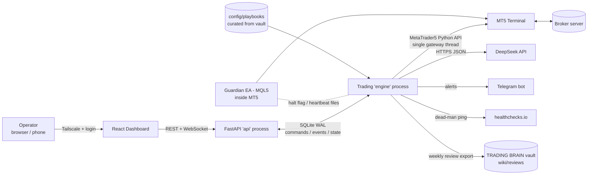
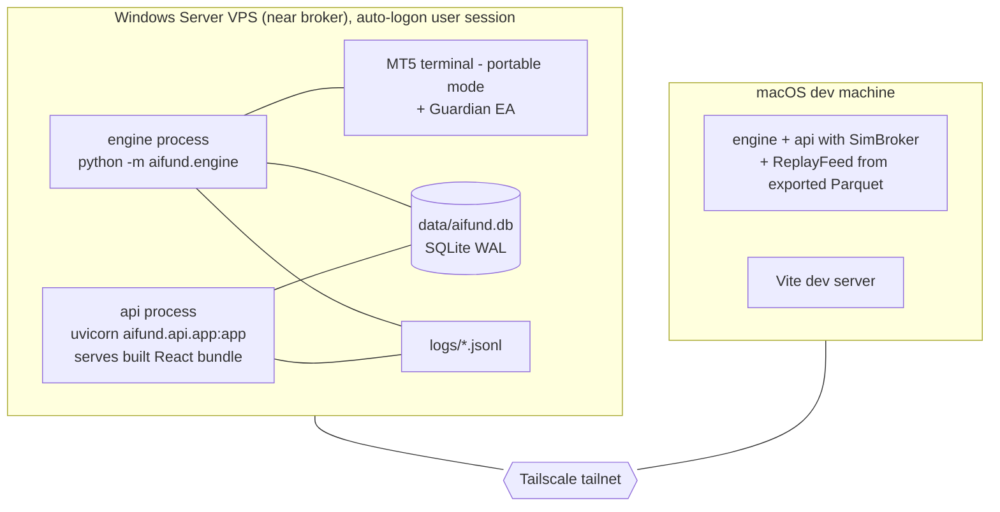
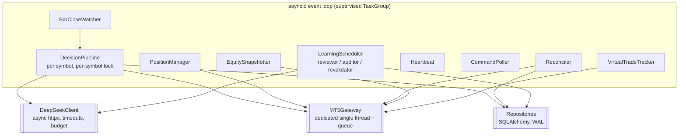
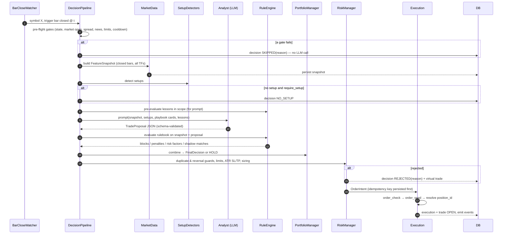
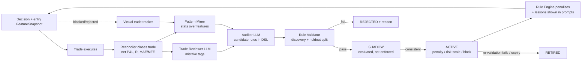
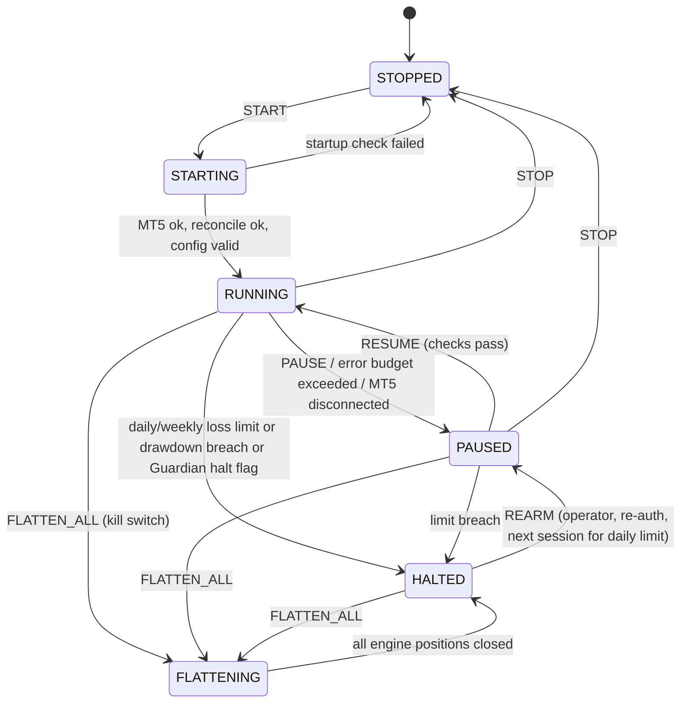

# 01 — System Architecture

## 1. Guiding principles (non-negotiable)

1. **LLMs propose, code disposes.** Every order passes through a deterministic Risk Manager that can veto,
   resize or clamp anything an agent suggests. No code path lets LLM text reach `order_send`.
2. **Fail closed.** Any exception, timeout, stale data, malformed LLM output, or unknown broker state on the
   decision path results in *no new exposure*. Existing positions keep their server-side SL/TP.
3. **Broker is truth for positions; the DB is truth for intent and context.** The reconciler continuously
   aligns the two and alerts on any disagreement.
4. **Idempotent and restart-safe.** Killing the engine at any line of code and restarting it must not create
   a duplicate order or lose a trade record.
5. **Record everything needed to learn.** Every decision (including HOLDs and skips) stores its feature
   snapshot, prompts, raw responses, rules applied, risk calculation and broker result.
6. **Learn slowly and reversibly.** Learned rules need statistical evidence, a shadow period, a version, an
   expiry, and can be retired. The rulebook is versioned and every decision records which version it used.
7. **Ports and adapters.** Core logic depends on interfaces (`BrokerPort`, `LLMPort`, `ClockPort`,
   `NotifierPort`), never on `MetaTrader5` or HTTP clients directly.

---

## 2. System context



---

## 3. Deployment topology



- **Production:** everything on one Windows VPS. MT5 terminal runs in an interactive, auto-logged-on user
  session (GUI app — do not run it in session 0 as a service). Engine and API are started by Task Scheduler
  at logon and supervised (see `06_OPERATIONS_AND_SECURITY.md`).
- **Development:** macOS cannot install the `MetaTrader5` package. The engine runs with `BROKER=sim`, fed by
  Parquet bar files exported from the VPS by `scripts/export_history.py`. The same test suite runs on both.

---

## 4. Process model

| Process | Responsibility | Talks to | Crash impact |
|---------|---------------|----------|--------------|
| `engine` | All trading loops, agents, risk, execution, reconciliation, learning | MT5 (gateway thread), DeepSeek, DB, Telegram | No new trades; open positions protected by server-side SL/TP and Guardian EA. Auto-restarted. |
| `api` | Auth, read models, command submission, live event stream, serves dashboard | DB only | Dashboard unavailable; trading unaffected |
| Guardian EA | Hard equity limits, emergency flatten, calendar export, heartbeat watch | MT5 internals, files in `Common\Files` | Loss of the independent safety net only |

**Inter-process communication is through the database only** — no Redis, no message broker:

- API → engine: insert a row in `commands` (e.g. `PAUSE`, `FLATTEN_ALL`, `CLOSE_POSITION`). The engine's
  `CommandPoller` picks it up within 1 s, executes, and writes the result back to the row.
- Engine → API: engine appends to `events`; the API tails `events` (by monotonic id) and pushes to
  WebSocket clients. Read models (positions, trades, decisions) are plain table reads.
- Engine liveness: `heartbeats` row updated every 10 s; the API marks the engine *stale* after 30 s.

### Inside the engine process



- `MT5Gateway` is an actor: one OS thread imports `MetaTrader5`, owns `initialize()`/reconnect, and serves
  requests from an `asyncio`-awaitable queue. Every call has a timeout. It converts broker server time to UTC
  at the boundary and returns typed domain objects, never raw `mt5` namedtuples.
- The asyncio loop is never blocked: CPU work (indicators) runs in a thread pool; LLM calls are async.

---

## 5. The agent roster

"Agent" here means a component with a single responsibility and a typed input/output contract. Only some are
LLM-backed. **Anything touching money is deterministic.**

| Agent | Kind | Input | Output | Phase |
|-------|------|-------|--------|-------|
| **Market Data Agent** | Deterministic | Closed bars for all TFs of a symbol | `FeatureSnapshot` (versioned, persisted) | 1 |
| **Regime Classifier** | Deterministic (LLM optional later) | `FeatureSnapshot` | `regime`: TREND_UP / TREND_DOWN / RANGE / VOLATILE / QUIET | 1 |
| **Setup Detectors** | Deterministic, one per playbook | `FeatureSnapshot`, regime | `SetupCandidate[]` (setup_tag, direction hint, key levels) | 2 / 8 |
| **Analyst Agent** | LLM (DeepSeek) | Snapshot, setup candidates, playbook cards, relevant lessons | `TradeProposal` (direction, confidence, setup_tag, invalidation, targets, thesis, risks) | 4 |
| **Specialist Analysts** (trend / breakout / reversal) | LLM | Same, filtered to their playbook family | `TradeProposal` each | 8 |
| **Risk Critic** (devil's advocate) | LLM | Best proposal + snapshot | `Critique` (objections with severity) | 8 |
| **Rule Engine** | Deterministic | Snapshot + proposal + active rulebook | Blocks, penalty points, risk scale factors, shadow matches | 7 |
| **Portfolio Manager** | Deterministic | Proposals, critique, rule results, calibration | `FinalDecision` (direction, final confidence) or HOLD | 4 / 8 |
| **Risk Manager** | Deterministic, **veto power** | `FinalDecision`, account, positions, limits, symbol spec | `OrderIntent` (volume, SL, TP, risk money) or `Rejection(reason)` | 2 |
| **Execution Agent** | Deterministic | `OrderIntent` | Fill / rejection / UNKNOWN, persisted | 2 |
| **Position Manager** | Deterministic | Open positions, bars | SL modifications, time-stops, weekend flatten | 2 |
| **Reconciler** | Deterministic | Broker positions + deal history, DB trades | Closed-trade records, orphan alerts | 3 |
| **Trade Reviewer** | LLM | One closed trade with its full context | Mistake-taxonomy tags, thesis verdict, lesson text | 7 |
| **Pattern Miner** | Deterministic (statistics) | Closed + virtual trades with entry features | Ranked loss clusters with effect sizes and CIs | 7 |
| **Auditor Agent** | LLM | Miner output, reviewer tags, sample narratives, current rulebook | Candidate rules in DSL + qualitative lessons | 7 |
| **Rule Validator** | Deterministic (statistics) | Candidate rules, trade history | Accept/reject with evidence; action severity | 7 |
| **Rule Lifecycle Manager** | Deterministic | Rules, shadow results, re-validation | Status transitions, rulebook versions | 7 |
| **Calibrator** | Deterministic | LLM confidence vs outcomes | Isotonic confidence → probability map | 8 |
| **Supervisor / Watchdog** | Deterministic | Heartbeats, error rates, limits | Engine state transitions, alerts | 5 |

---

## 6. Loops and cadences (engine)

| Loop | Cadence | Does |
|------|---------|------|
| `Heartbeat` | 10 s | Updates `heartbeats`; writes heartbeat file for Guardian EA; pings healthchecks.io every 60 s |
| `CommandPoller` | 1 s | Executes pending `commands` |
| `BarCloseWatcher` | 2 s | Detects a newly closed bar on each symbol's trigger TF → schedules `DecisionPipeline` |
| `DecisionPipeline` | On trigger-TF bar close, per symbol | Full pipeline (see `03_TRADING_CORE.md` §3) |
| `PositionManager` | 5 s | Break-even / trailing (if enabled), time-stops, Friday flatten, missing-SL repair |
| `Reconciler` | 30 s + on startup + after every execution | Align broker vs DB, close trades, detect orphans |
| `EquitySnapshotter` | 60 s | Balance, equity, margin, open risk → `equity_snapshots`; drives loss limits |
| `VirtualTradeTracker` | 60 s | Advances virtual trades for blocked/rejected signals |
| `TradeReviewer` | On each trade close (queued) | LLM review of the closed trade |
| `Auditor` | Nightly 00:30 UTC, or ≥ N new closed trades (cooldown 12 h), or manual | Mining → LLM audit → validation → candidates into shadow |
| `RuleRevalidator` | Weekly + nightly for rules past `review_at` | Promote / keep / retire |
| `Supervisor` | 5 s | Watches loop health, error budgets, limit breaches → state transitions |

Every loop is wrapped by a supervisor that catches exceptions, logs them with context, counts them against an
error budget, and restarts the loop with backoff. Repeated failures in a money-path loop move the engine to
`PAUSED` (no new entries).

---

## 7. Decision pipeline (sequence)



---

## 8. Learning loop (overview — detail in `04_LEARNING_LOOP.md`)



---

## 9. Engine state machine



| State | New entries | Position management | Reconciliation | Learning |
|-------|-------------|---------------------|----------------|----------|
| RUNNING | yes | yes | yes | yes |
| PAUSED | **no** | yes | yes | yes |
| HALTED | **no** | yes (SL/TP stay) | yes | yes |
| FLATTENING | **no** | closes all engine positions | yes | no |
| STOPPED | no | no | no | no |

The state is persisted in `engine_state`; after a restart the engine resumes into `PAUSED` if it was
`RUNNING`, and requires reconciliation to pass before returning to `RUNNING`. `HALTED` survives restarts.

Trading **mode** is orthogonal to state: `SIM` (SimBroker + replay), `PAPER` (live MT5 data, SimBroker
fills), `DEMO` (real orders, account must report `trade_mode == DEMO`), `LIVE` (requires config flag
`allow_live: true` **and** an operator confirmation command). The engine refuses to start `DEMO` on a real
account and `LIVE` on a demo account.

---

## 10. Failure modes and responses

| Failure | Detection | Response |
|---------|-----------|----------|
| MT5 terminal disconnected / closed | Gateway call error, `terminal_info().connected == False`, tick age | Reconnect with backoff; after 60 s → `PAUSED` + alert; resume after reconcile passes |
| AutoTrading disabled in terminal | `terminal_info().trade_allowed == False` or retcode `CLIENT_DISABLES_AT` | `PAUSED` + alert |
| Order result unknown (timeout / `None`) | `order_send` returns `None` or times out | Intent → `UNKNOWN`; symbol locked; resolve by searching positions/deals for the intent's comment key before any new action |
| DeepSeek timeout / 5xx / 429 | HTTP error | Retry ≤ 2 with jitter inside the bar budget; then HOLD. Circuit breaker opens after 5 consecutive failures (skips LLM for 10 min, alert) |
| Malformed LLM output | Pydantic validation error | One repair retry with the validation error; then HOLD |
| LLM budget exhausted | Daily token/cost counter | HOLD for LLM-dependent decisions; alert |
| Stale / gapped bars | Last closed bar time ≠ expected | Skip decision with reason `STALE_DATA` |
| Spread spike (rollover, news) | spread > limits | Skip with `SPREAD_TOO_WIDE` |
| Loss limit breach | EquitySnapshotter | `HALTED` + alert; Guardian EA enforces a wider hard limit independently |
| Position without SL | PositionManager / Reconciler | Attach SL at `k_sl × ATR`; if that fails → close + alert |
| Orphan position (our magic, not in DB) | Reconciler | Create `ORPHAN` trade record, ensure SL, alert; never auto-reverse it |
| DB locked / disk full | Exception, disk check | `PAUSED` + alert |
| Engine crash | Supervisor exit, heartbeat stale | Task Scheduler restart; healthchecks.io alert; restart lands in `PAUSED` |
| Clock drift | NTP check, tick-time offset | Alert if > 2 s |

---

## 11. Technology stack

### Backend (Python 3.12 — confirm the `MetaTrader5` wheel supports the chosen version on the VPS)

| Concern | Choice | Notes |
|---------|--------|-------|
| Package / env | `uv` + `pyproject.toml` | Lockfile committed. `MetaTrader5` as an optional extra (`[mt5]`) so macOS installs work |
| Web | FastAPI + Uvicorn | Lifespan handlers (not deprecated `on_event`) |
| Models / validation | Pydantic v2, pydantic-settings | Domain models are Pydantic; strict mode on LLM outputs |
| DB | SQLAlchemy 2.0 (typed ORM) + Alembic, SQLite WAL | `PRAGMA journal_mode=WAL; busy_timeout=5000; foreign_keys=ON` |
| LLM | `openai` SDK pointed at DeepSeek `base_url` (OpenAI-compatible) | JSON output mode; model id from config; verify ids via DeepSeek's `/models` endpoint and docs |
| Retries | `tenacity` | Only for idempotent calls (never for `order_send`) |
| Numerics | numpy, pandas | **Own** indicator implementations (EMA, Wilder RSI/ATR, ADX, BB) tested against reference values. Do not use `pandas-ta` |
| Stats | scipy (bootstrap, tests), scikit-learn (isotonic calibration only) | |
| Logging | `structlog` → JSON lines, rotating files | Correlation ids: `decision_id`, `intent_id`, `position_id` |
| Alerts | Telegram Bot API (send-only) | |
| Tests | pytest, pytest-asyncio, hypothesis, time-machine | No network in unit tests |
| Quality | ruff (lint + format), mypy (strict on `domain`, `risk`, `execution`, `reconcile`, `rules`) | |

### Frontend

| Concern | Choice |
|---------|--------|
| Build | Vite + React + TypeScript (strict) |
| Data | TanStack Query (REST), native WebSocket with reconnect |
| Types | `openapi-typescript` generated from FastAPI's OpenAPI schema — no hand-written API types |
| UI | Tailwind CSS + shadcn/ui, TanStack Table |
| Charts | TradingView `lightweight-charts` (price + trade markers), Recharts (equity, analytics) |
| Validation | zod for forms |

### Deliberately excluded (add only via an ADR in `docs/adr/`)

- **LangChain / LangGraph / CrewAI** — the pipeline is a fixed, auditable sequence; frameworks add
  abstraction, version churn and hidden prompts. (The prototype lists them but never uses them.)
- **ChromaDB / vector DB** — playbooks are a small curated set selected by `setup_tag`; retrieval by tag is
  exact and explainable. Revisit only if the card library grows past what fits in context.
- **Redis / Celery / Kafka** — one host, one writer; the DB is the queue.
- **pandas-ta** — unmaintained, breaks with modern numpy.

---

## 12. Repository layout (target)

```text
ai-hedge-fund/
├── AGENTS.md                      # rules for the AI coding agent (read first)
├── docs/                          # this specification + PROGRESS.md + adr/
├── legacy/                        # the original prototype, read-only reference
├── config/
│   ├── trading.example.yaml       # risk, symbols, timeframes, agents, learning (no secrets)
│   └── playbooks/*.yaml           # playbook cards curated from the vault
├── .env.example                   # secrets only
├── backend/
│   ├── pyproject.toml
│   ├── alembic/
│   ├── src/aifund/
│   │   ├── config/                # settings.py (env), trading_config.py (YAML schema), loader
│   │   ├── domain/                # pydantic models, enums, value objects, errors — no I/O
│   │   ├── ports/                 # BrokerPort, LLMPort, ClockPort, NotifierPort, MarketDataPort
│   │   ├── adapters/
│   │   │   ├── mt5/               # gateway.py (thread actor), mapping.py, retcodes.py, server_time.py
│   │   │   ├── sim/               # sim_broker.py, replay_feed.py, fill_model.py
│   │   │   ├── llm/               # deepseek.py, fake_llm.py, budget.py, circuit_breaker.py
│   │   │   └── notify/            # telegram.py, healthchecks.py, null.py
│   │   ├── market/                # indicators.py, features.py, feature_registry.py, regime.py, bar_clock.py
│   │   ├── strategies/            # setup detectors, one module per playbook
│   │   ├── agents/                # analyst.py, specialists.py, critic.py, reviewer.py, auditor.py
│   │   │   └── prompts/           # versioned prompt templates (*.j2) + output schemas
│   │   ├── rules/                 # dsl.py, engine.py, miner.py, validator.py, lifecycle.py, calibration.py
│   │   ├── risk/                  # sizing.py, stops.py, guards.py, limits.py, exposure.py, manager.py
│   │   ├── execution/             # executor.py, idempotency.py, filling.py
│   │   ├── reconcile/             # reconciler.py, pnl.py, enrichment.py, virtual.py
│   │   ├── engine/                # main.py, orchestrator.py, pipeline.py, state_machine.py,
│   │   │                          #   loops.py, supervisor.py, commands.py
│   │   ├── persistence/           # db.py, tables.py, repositories/*.py, backup.py
│   │   ├── api/                   # app.py, auth.py, deps.py, ws.py, routers/*.py
│   │   └── vault/                 # playbook_compiler.py, review_exporter.py
│   ├── tests/
│   │   ├── unit/  integration/  scenario/  fixtures/ (recorded MT5 deals, bars, LLM responses)
│   └── scripts/                   # export_history.py, seed_demo.py, replay.py, compile_playbooks.py
├── frontend/                      # Vite React app
├── mql5/                          # GuardianEA.mq5
└── deploy/windows/                # install.ps1, tasks/*.xml, run_engine.ps1, run_api.ps1, backup.ps1
```

Dependency rule (enforced with `import-linter` in CI):
`domain` ← `market`, `risk`, `rules`, `strategies` ← `agents`, `execution`, `reconcile` ← `engine` ← `api`.
`adapters` implement `ports`; only `engine/main.py` and `api/app.py` wire concrete adapters. `domain`, `risk`
and `rules` import nothing with I/O.
