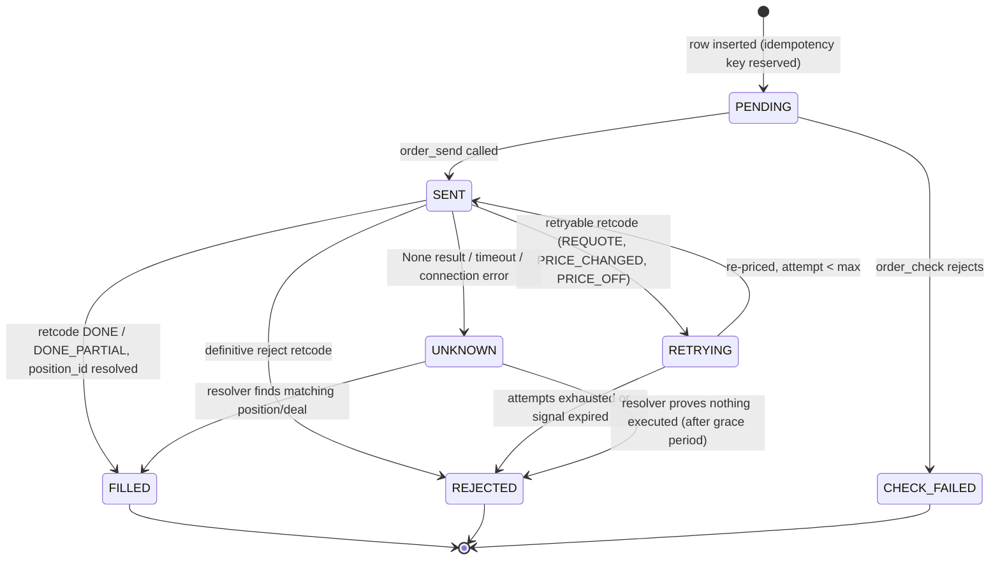
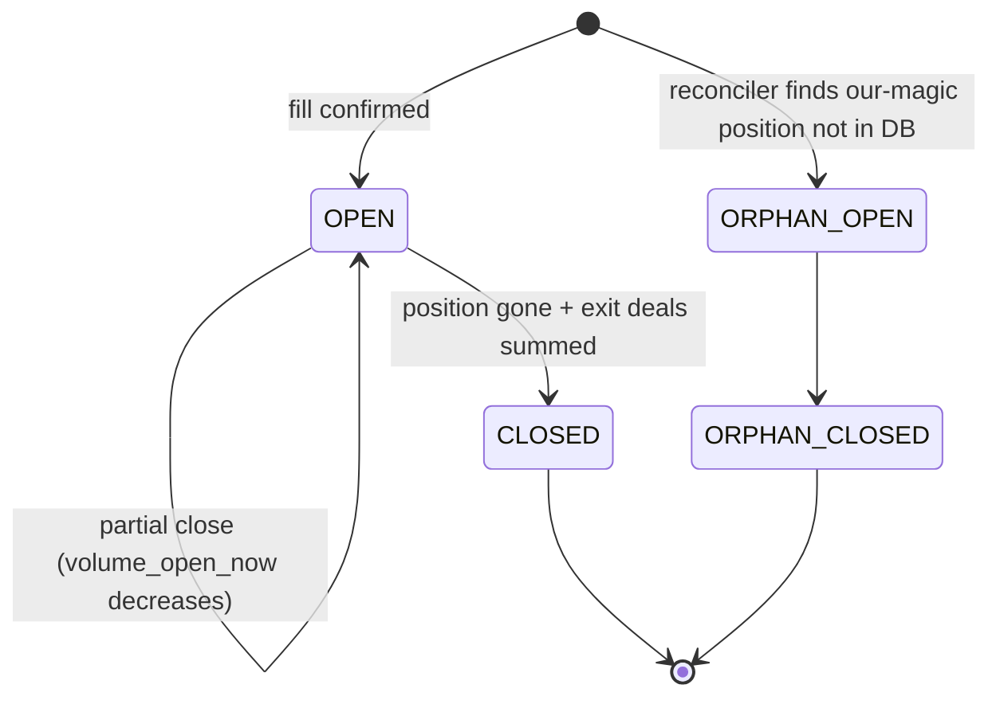
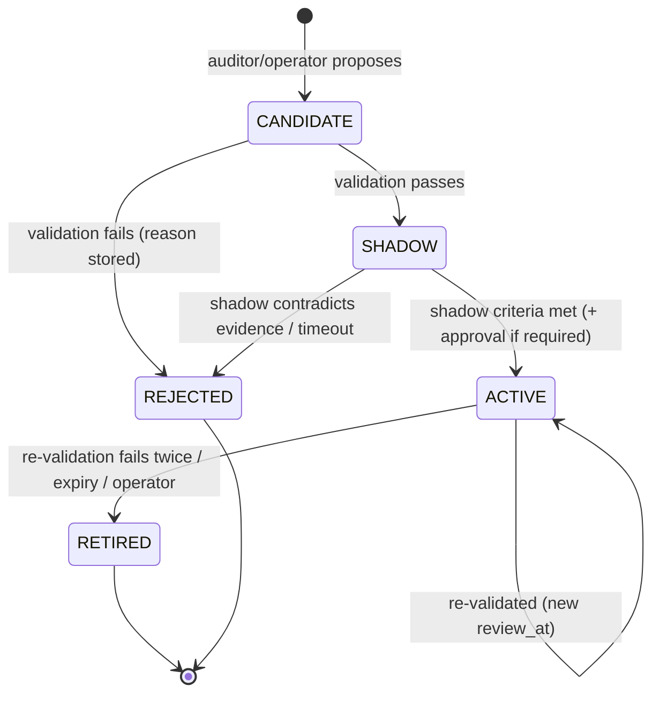

# 02 — Data Model, State Machines, Feature Registry, Config

Conventions for all tables:

- Primary keys: `id` = ULID string (sortable, generated in app) unless noted.
- Timestamps: stored as UTC ISO-8601 strings with `Z` (SQLite) / `timestamptz` (Postgres). Broker server time is
  converted to UTC in the MT5 gateway; raw server epoch is kept only in `deals.time_server`.
- Money: stored as `NUMERIC` via SQLAlchemy `Numeric(18, 6)` → Python `Decimal`. Prices: `Numeric(18, 8)`.
- JSON columns: SQLAlchemy `JSON`. Every JSON blob has a `*_version` sibling column when its shape can evolve.
- Every table has `created_at`; mutable tables have `updated_at`.
- `account_id` is present on trading tables so a second account can be added later without migration pain.

---

## 1. Tables

### 1.1 System & control

**`engine_state`** (single row per account)
| column | type | notes |
|---|---|---|
| account_id | str PK | |
| state | enum | STOPPED / STARTING / RUNNING / PAUSED / HALTED / FLATTENING |
| mode | enum | SIM / PAPER / DEMO / LIVE |
| halt_reason | str null | |
| day_start_equity | Numeric | reset at configured trading-day boundary |
| peak_equity | Numeric | for drawdown |
| config_version_id | FK config_versions | active config |
| rulebook_version | int | active rulebook |
| updated_at | ts | |

**`heartbeats`**: `component` PK (engine, gateway, each loop), `last_beat_at`, `status`, `detail JSON`.

**`commands`**: `id`, `type` (START, PAUSE, RESUME, STOP, REARM, FLATTEN_ALL, CLOSE_POSITION, RUN_AUDIT,
APPROVE_RULE, REJECT_RULE, RETIRE_RULE, RELOAD_CONFIG, SET_MODE), `payload JSON`, `status`
(PENDING/RUNNING/DONE/FAILED), `result JSON`, `requested_by`, `created_at`, `started_at`, `finished_at`.

**`events`**: `seq` INTEGER PK AUTOINCREMENT (monotonic, used by API tailing), `ts`, `type`, `severity`,
`payload JSON`. Retained 30 days.

**`config_versions`**: `id`, `yaml_text`, `sha256`, `created_by`, `created_at`, `comment`.

**`audit_log`**: every operator action and config change: `id`, `actor`, `action`, `before JSON`, `after JSON`,
`ip`, `ts`.

**`llm_calls`**: `id`, `agent` (analyst/critic/reviewer/auditor…), `decision_id` null, `trade_id` null,
`audit_run_id` null, `model`, `prompt_template`, `prompt_version`, `prompt_sha256`, `messages JSON` (full),
`response_text`, `parsed JSON`, `valid bool`, `error`, `prompt_tokens`, `completion_tokens`,
`cached_tokens`, `cost_usd`, `latency_ms`, `created_at`.

### 1.2 Market & decisions

**`symbols`**: broker symbol spec cache refreshed daily: `symbol` PK, `canonical`, `asset_class`, `digits`,
`point`, `tick_size`, `tick_value`, `contract_size`, `volume_min`, `volume_max`, `volume_step`,
`stops_level`, `freeze_level`, `filling_mode`, `trade_mode`, `currency_profit`, `currency_margin`, `raw JSON`,
`refreshed_at`.

**`feature_snapshots`**: `id`, `symbol`, `trigger_tf`, `bar_time` (open time of the closed trigger bar, UTC),
`feature_set_version`, `features JSON` (flat dict keyed by registry names, see §3), `bars_ref JSON`
(last bar times per TF — proves no forming bar was used), `created_at`.
Unique: (`symbol`, `trigger_tf`, `bar_time`, `feature_set_version`).

**`decisions`**: one per pipeline run.
| column | notes |
|---|---|
| id | ULID |
| symbol, trigger_tf, bar_time | |
| snapshot_id | FK |
| stage_reached | PREFLIGHT / SETUP / ANALYST / RULES / PORTFOLIO / RISK / EXECUTION |
| outcome | SKIPPED / NO_SETUP / HOLD / RULE_BLOCKED / BELOW_THRESHOLD / RISK_REJECTED / ORDERED / ERROR |
| reason_code, reason_detail | e.g. `SPREAD_TOO_WIDE`, `DUPLICATE_SAME_DIRECTION` |
| setups JSON | detector output |
| proposal JSON | validated `TradeProposal` (or null) |
| llm_confidence, calibrated_confidence, penalty_points, final_confidence | ints / floats |
| risk_factor | product of rule/regime risk scalers |
| rules_matched JSON | [{rule_id, version, mode(active/shadow), action}] |
| lessons_shown JSON | rule ids rendered into prompt |
| rulebook_version, prompt_version, model, config_version_id | provenance |
| risk_calc JSON | full sizing worksheet (see 03 §7) |
| intent_id | FK null |
| latency_ms, cost_usd | |

### 1.3 Orders, trades, deals

**`order_intents`**
| column | notes |
|---|---|
| id | ULID; also encoded in order comment |
| idempotency_key | **UNIQUE** — sha256(account, symbol, trigger_tf, bar_time, direction, strategy_version)[:24] |
| decision_id | FK |
| kind | OPEN / CLOSE / REVERSE_CLOSE / MODIFY_SLTP / FLATTEN |
| symbol, side, volume, price_ref, sl, tp | requested values |
| risk_money, risk_pct | |
| comment | `AF:<8-char intent code>` (MT5 comments are ≤ 31 chars; brokers may truncate/replace, so never rely on it alone) |
| magic | |
| status | see state machine §2.1 |
| retcode, retcode_name, broker_comment | last result |
| order_ticket, deal_ticket, position_id | resolved identifiers |
| fill_price, fill_volume, slippage_points | |
| attempts | |
| created_at, sent_at, resolved_at | |

**`trades`** (one per broker position)
| column | notes |
|---|---|
| id | ULID |
| position_id | **UNIQUE** — MT5 position identifier (from the entry deal's `position_id`) |
| intent_id, decision_id, snapshot_id | provenance (null for ORPHAN) |
| symbol, side, setup_tag, trigger_tf | |
| status | OPEN / CLOSED / ORPHAN_OPEN / ORPHAN_CLOSED |
| open_time, open_price, volume_opened, volume_open_now | |
| initial_sl, initial_tp, current_sl, current_tp | |
| initial_risk_money | money lost if initial SL hit (incl. est. commission) — denominator of R |
| close_time, close_price_vwap, close_reason | SL / TP / STOP_OUT / ENGINE / OPERATOR / MANUAL_EXTERNAL / REVERSAL / TIME_STOP / FLATTEN |
| gross_profit, commission, swap, fee, net_pnl | Σ over all deals of the position |
| r_multiple | net_pnl / initial_risk_money |
| mae_r, mfe_r | max adverse / favourable excursion in R (from M1 bars) |
| bars_held, holding_minutes | |
| outcome | WIN (R ≥ +0.1) / LOSS (R ≤ −0.1) / BREAKEVEN |
| review_status | PENDING / DONE / FAILED |
| is_virtual | false here (virtual trades live in their own table) |

**`deals`**: raw mirror of MT5 deals for engine positions (and orphans): `ticket` PK, `order`, `position_id`,
`time_utc`, `time_server`, `type`, `entry` (IN/OUT/INOUT/OUT_BY), `reason`, `magic`, `symbol`, `volume`,
`price`, `profit`, `commission`, `swap`, `fee`, `comment`, `raw JSON`. Idempotent upsert by ticket.

**`virtual_trades`**: counterfactual trades for signals that were blocked or rejected (not for HOLDs):
`id`, `decision_id`, `symbol`, `side`, `setup_tag`, `entry_time`, `entry_price` (next bar open + half
spread), `sl`, `tp`, `status` OPEN/CLOSED/EXPIRED, `exit_time`, `exit_price`, `exit_reason`, `r_multiple`,
`mae_r`, `mfe_r`, `blocked_by` (rule id / guard reason), `snapshot_id`.

**`equity_snapshots`**: `ts`, `balance`, `equity`, `margin`, `free_margin`, `open_risk_money`,
`open_positions`, `day_pnl`, `drawdown_pct`.

### 1.4 Learning

**`trade_reviews`**: `trade_id` PK/FK, `tags JSON` (from fixed taxonomy), `thesis_verdict`
(CORRECT / WRONG / UNCLEAR), `execution_quality` (1–5), `lesson`, `llm_call_id`, `created_at`.

**`rules`** (versioned; a new version is a new row)
| column | notes |
|---|---|
| rule_id | e.g. `R-0042` |
| version | int; (rule_id, version) PK |
| status | CANDIDATE / REJECTED / SHADOW / ACTIVE / RETIRED — see §2.3 |
| dsl JSON | scope + conditions + action (see `04_LEARNING_LOOP.md` §5) |
| dsl_sha256 | dedup |
| hypothesis | causal explanation (from auditor) |
| evidence JSON | discovery / holdout / shadow stats |
| origin | AUDITOR / OPERATOR / MIGRATED |
| audit_run_id | FK |
| approved_by, approved_at | |
| shadow_started_at, activated_at, review_at, expires_at, retired_at, retire_reason | |

**`rulebook_versions`**: `version` PK, `active_rules JSON` [(rule_id, version)], `shadow_rules JSON`,
`created_at`, `reason`.

**`rule_evaluations`**: `decision_id`, `rule_id`, `rule_version`, `mode` (ACTIVE/SHADOW), `matched bool`,
`action_applied JSON`. (Only matched rows stored to keep the table small.)

**`audit_runs`**: `id`, `trigger` (SCHEDULE/THRESHOLD/MANUAL), `window_from`, `window_to`, `n_trades`,
`n_virtual`, `miner_output JSON`, `llm_call_id`, `candidates JSON`, `validation JSON`, `lessons_md`,
`status`, `created_at`, `finished_at`.

**`calibration_models`**: `version`, `method` (IDENTITY/ISOTONIC), `params JSON`, `n_samples`,
`brier_before`, `brier_after`, `created_at`, `active bool`.

---

## 2. State machines

### 2.1 `OrderIntent.status`



Rules: an intent in `PENDING`, `SENT`, `RETRYING` or `UNKNOWN` **locks its symbol** for new OPEN intents.
On startup, every non-terminal intent goes through the UNKNOWN resolver before anything else runs.

### 2.2 `Trade.status`



Orphan trades are excluded from learning (no entry snapshot) but included in P&L and limits.

### 2.3 `Rule.status`



Any status change creates a new `rulebook_versions` row if the active or shadow set changed.

---

## 3. Feature registry

The registry (`market/feature_registry.py`) is the **contract** between the market data agent, the rule DSL, the
miner and the LLM auditor. Rules may only reference registered features. Each entry:

```python
FeatureSpec(
    name="h1.rsi14",               # "<tf>.<feature>" or "ctx.<feature>"
    dtype="float",                 # float | int | bool | category
    unit="index 0-100",
    description="Wilder RSI(14) on last closed H1 bar",
    categories=None,               # for category dtype
    available_at_entry=True,       # MUST be True for anything a rule can use
    since_version=1,
)
```

TF roles are configured per symbol profile: `context` (D1/H4), `setup` (H1), `trigger` (M15). Features are
computed for each TF in the profile. Initial set (`feature_set_version = 1`):

| Group | Features (per TF unless `ctx.`) |
|---|---|
| Trend | `ema20`, `ema50`, `ema200` (as distance from close in ATR units: `dist_ema200_atr`), `ema50_slope_atr` (5-bar slope / ATR), `ema_stack` (category: BULL/BEAR/MIXED), `adx14`, `close_above_ema200` (bool) |
| Momentum | `rsi14`, `rsi14_slope3`, `macd_hist_z` (z-score over 100 bars) |
| Volatility | `atr14`, `atr14_pct_rank100` (percentile of ATR over last 100 bars), `bb_width_pct_rank100`, `range_to_atr` (last bar range / ATR), `nr7` (bool) |
| Volume | `rel_tick_volume20` (tick volume / 20-bar mean) |
| Structure | `dist_swing_high_atr`, `dist_swing_low_atr` (fractal swings, 5-bar), `dist_pdh_atr`, `dist_pdl_atr` (previous day high/low), `bars_since_swing_break` |
| Candle | `body_to_range`, `upper_wick_to_range`, `lower_wick_to_range`, `candle_dir` (category) |
| Context (`ctx.`) | `session` (ASIA/LONDON/NY/OVERLAP/OFF), `day_of_week`, `minutes_to_next_high_impact_news`, `minutes_since_last_high_impact_news`, `spread_to_atr` (trigger TF), `regime` (category), `htf_alignment` (−2..+2: context+setup trend vs proposed direction), `open_positions_count`, `symbol_open_risk_pct`, `portfolio_heat_pct`, `consecutive_losses_symbol`, `drawdown_pct` |
| Proposal (`prop.`) | `direction`, `setup_tag`, `llm_confidence`, `sl_atr_multiple`, `rr_target` — known at decision time, so rule-usable |

Post-trade fields (`mae_r`, reviewer tags, outcome) are **not** in the registry with
`available_at_entry=True` and therefore can never appear in a rule condition — this prevents lookahead leakage.

Adding a feature = bump `feature_set_version`, backfill is not required (rules referencing a feature ignore
snapshots that lack it; the miner only uses snapshots that have it).

---

## 4. Configuration

Two sources, both validated at startup by Pydantic; the engine refuses to start on any validation error.

- **`.env`** — secrets and host-specific paths only: `DEEPSEEK_API_KEY`, `MT5_LOGIN`, `MT5_PASSWORD`,
  `MT5_SERVER`, `MT5_PATH`, `TELEGRAM_BOT_TOKEN`, `TELEGRAM_CHAT_ID`, `HEALTHCHECKS_URL`,
  `API_SECRET_KEY`, `ADMIN_PASSWORD_HASH`, `DATABASE_URL`, `BROKER` (mt5|sim), `CONFIG_PATH`.
- **`config/trading.yaml`** — everything else. Stored into `config_versions` on load; changes from the
  dashboard produce a new version and an `audit_log` row. Keys marked *(re-auth)* need password re-entry.

```yaml
engine:
  account_label: exness-demo-1
  mode: DEMO                    # SIM | PAPER | DEMO | LIVE (re-auth)
  allow_live: false             # (re-auth) must be true for LIVE
  magic: 26092801
  trading_day_boundary_utc: "21:00"   # align with broker rollover
  timezone_display: "Asia/Kolkata"
  auto_resume_after_crash: false
  bar_close_grace_s: 3
  max_deviation_points: 20

strategy:
  analyst_enabled: true         # false = deterministic baseline only (LLM outage fallback)
  baseline_enabled: false       # deterministic mtf_trend_pullback trading without LLM (Phase 2)

symbols:                        # canonical -> broker symbol + profile
  - canonical: XAUUSD
    broker: XAUUSDm
    asset_class: metal
    profile: intraday_m15
    correlation_bucket: USD_INVERSE
    max_spread_points: 250
    max_spread_to_atr: 0.15
    trade_weekends: false
  - canonical: BTCUSD
    broker: BTCUSDm
    asset_class: crypto
    profile: intraday_m15
    correlation_bucket: CRYPTO
    max_spread_to_atr: 0.10
    trade_weekends: true

profiles:
  intraday_m15:
    trigger_tf: M15
    setup_tf: H1
    context_tfs: [H4, D1]
    bars_per_tf: 300            # enough for EMA200 warm-up + percentile windows
    require_setup: true         # skip LLM when no detector fires

risk:
  risk_per_trade_pct: 0.5       # (re-auth to raise)
  max_risk_per_trade_pct: 1.0   # hard ceiling after all multipliers
  confidence_threshold: 65      # final confidence needed to trade
  confidence_risk_scaling: {at_threshold: 0.5, at_90: 1.0}
  vol_regime_scaling: {atr_pct_rank_above: 0.9, factor: 0.5}
  drawdown_scaling: {dd_pct_above: 5.0, factor: 0.5}
  stops:
    atr_tf: trigger
    k_sl_default: 1.5
    k_sl_min: 1.0
    k_sl_max: 3.0
    invalidation_buffer_atr: 0.1
    rr_default: 2.0
    rr_min: 1.2
    rr_max: 4.0
  min_lot_overshoot_pct: 0      # 0 = never upsize to volume_min
  max_lots_per_symbol: 5.0
  commission_per_lot_roundtrip: auto   # auto = learned from deals history, or a number
  max_margin_utilisation: 0.30
  limits:
    max_open_positions: 5
    max_positions_per_symbol: 1
    max_portfolio_heat_pct: 3.0         # Σ open initial risk
    max_bucket_heat_pct: 1.5            # per correlation bucket
    max_trades_per_symbol_per_day: 4
    daily_loss_limit_pct: 3.0           # → HALTED until next trading day
    weekly_loss_limit_pct: 6.0          # → HALTED until operator re-arm
    max_drawdown_pct: 10.0              # from peak → HALTED + re-arm (re-auth)
  guards:
    cooldown_bars_after_close: 2
    cooldown_bars_after_loss: 4
    block_if_foreign_position_on_symbol: true
    reversal_mode: close_only           # ignore | close_only | close_and_reverse
    reversal_extra_confidence: 15
    reversal_min_hold_bars: 3
    max_reversals_per_symbol_per_day: 1
    flip_flop_window: 3
    flip_flop_lock_bars: 8
  news:
    enabled: true
    blackout_minutes_before: 15
    blackout_minutes_after: 15
    impact: [HIGH]

position_management:
  break_even_at_r: null         # e.g. 1.0 to move SL to entry+costs at +1R
  trailing: {mode: off}         # off | atr (k)
  time_stop_bars: 48            # close if still open after N trigger bars
  flatten_friday_utc: "20:30"   # non-weekend symbols only

llm:
  provider: deepseek
  base_url: https://api.deepseek.com
  analyst_model: "<set from DeepSeek /models>"
  auditor_model: "<set from DeepSeek /models>"   # may be a reasoning model
  temperature: 0.1
  timeout_s: 30
  auditor_timeout_s: 180
  max_retries: 2
  daily_budget_usd: 5.0
  circuit_breaker: {failures: 5, open_minutes: 10}

learning:
  audit_schedule_utc: "00:30"
  audit_min_new_trades: 10
  audit_cooldown_hours: 12
  window_days: 120
  min_matches_total: 20
  min_matches_holdout: 6
  min_effect_r: 0.30
  fdr_q: 0.10
  holdout_fraction: 0.30
  max_rule_conditions: 3
  max_rule_coverage: 0.30
  max_active_rules: 25
  max_total_penalty: 40
  shadow_min_matches: 10
  shadow_max_days: 30
  auto_promote_max_penalty: 15   # larger penalties, risk scales and blocks need approval
  review_after_days: 30
  expire_after_days: 90

alerts:
  telegram: true
  daily_summary_utc: "21:05"
```
