# 07 — Roadmap (phased, agent-sized tasks)

Each task is intended to be **one agent session / one PR**. "DoD" = definition of done. Every task also
implicitly requires: tests for new behaviour, `ruff` + `mypy` clean, no network in unit tests, `docs/PROGRESS.md`
updated. Size: S ≈ < 300 LOC, M ≈ 300–800, L ≈ 800+ (split L tasks if the agent struggles).

Build order rationale: prove the **plumbing with deterministic logic first** (data → risk → execution →
reconciliation), then add the LLM, then operations and UI, then learning. An LLM on top of broken plumbing
produces losses you cannot diagnose.

```mermaid
gantt
    dateFormat  X
    axisFormat  P%s
    section Core
    P0 Foundations            :p0, 0, 1
    P1 Market data & features :p1, after p0, 1
    P2 Risk & execution       :p2, after p1, 2
    P3 Reconciliation         :p3, after p2, 1
    section Intelligence
    P4 LLM analyst            :p4, after p3, 1
    P5 Engine ops             :p5, after p4, 1
    P6 API & dashboard        :p6, after p5, 2
    P7 Learning loop          :p7, after p6, 2
    P8 Multi-agent & playbooks:p8, after p7, 2
    section Production
    P9 Hardening & go-live    :p9, after p8, 2
```

Milestones: **M1** after P3 — deterministic baseline strategy trades a demo account end-to-end with correct
ledger. **M2** after P5 — LLM-driven engine runs 24/7 on demo (paper→demo). **M3** after P6 — operable from the
dashboard. **M4** after P7 — self-learning loop live in shadow → active. **M5** after P9 — go-live gates.

---

## Phase 0 — Foundations

| # | Task | Size | DoD |
|---|---|---|---|
| 0.1 | **Repo restructure.** `git init`; move prototype files into `legacy/` untouched; create layout from `01_ARCHITECTURE.md` §12; `.gitignore` (.env, data/, logs/, backups/, node_modules, .venv) | S | Tree matches spec; `legacy/` identical to original files; first commit |
| 0.2 | **Backend tooling.** `backend/pyproject.toml` (uv), deps per §11 with `MetaTrader5` in optional extra `[mt5]`; ruff, mypy (strict for domain/risk/execution/reconcile/rules), pytest config, import-linter contracts | S | `uv sync` works on macOS; `pytest` runs (0 tests OK); lint/type/import contracts pass |
| 0.3 | **CI** (GitHub Actions): lint, type, test on ubuntu + windows runners; windows job installs `[mt5]` extra to catch import issues | S | Green pipeline |
| 0.4 | **Config.** `config/settings.py` (env via pydantic-settings) + `trading_config.py` (full YAML schema from `02_DATA_MODEL.md` §4 with validators: percent ranges, k_sl_min ≤ default ≤ max, rr_min ≤ default ≤ max, LIVE requires allow_live); `trading.example.yaml`; `.env.example` | M | Invalid configs produce precise errors; tests for every validator |
| 0.5 | **Domain models.** Enums (Side, Direction, TF, EngineState, Mode, IntentStatus, TradeStatus, RuleStatus, ReasonCode, CloseReason), value objects (Price, Volume with step rounding helpers using Decimal), `Bar`, `Tick`, `SymbolSpec`, `Position`, `Deal`, `AccountInfo`, `OrderResult`, `FeatureSnapshot`, `SetupCandidate`, `TradeProposal`, `FinalDecision`, `OrderIntent`, `Rejection` | M | No I/O imports; exhaustive unit tests for Volume/Price rounding |
| 0.6 | **Ports.** `BrokerPort`, `MarketDataPort`, `LLMPort`, `ClockPort`, `NotifierPort` Protocols; `FakeClock`, `NullNotifier` | S | Typed; used by a trivial test |
| 0.7 | **Persistence.** SQLAlchemy models for all tables in `02_DATA_MODEL.md`; Alembic initial migration; SQLite pragmas (WAL, busy_timeout, foreign_keys); repositories with typed methods; ULID ids; Decimal round-trip | L | Migration up/down on empty DB; repository tests incl. UNIQUE idempotency key violation raising a domain error |
| 0.8 | **Logging.** structlog JSON config, redaction processor, correlation-id contextvars | S | Test proves secrets are redacted |
| 0.9 | **AGENTS.md + PROGRESS.md** kept current (already drafted; agent verifies commands listed actually work) | S | Commands in AGENTS.md executed successfully |

## Phase 1 — Market data & features

| # | Task | Size | DoD |
|---|---|---|---|
| 1.1 | **MT5 gateway** (`adapters/mt5`): single-thread actor, async request API with timeouts, initialize/login/reconnect with backoff, startup checks (`03` §1), typed mapping, server-time offset detection, retcode/constant tables | L | Unit tests with a fake `mt5` module object (monkeypatched) covering reconnect, timeout, None results, mapping, offset; runs for real on the VPS via `scripts/mt5_smoke.py` (prints account, symbols, last bars) |
| 1.2 | **History export** `scripts/export_history.py`: bars M1..D1 for configured symbols to Parquet (UTC), plus symbol specs JSON | S | Files produced on VPS; loaded on Mac |
| 1.3 | **SimBroker + ReplayFeed** (`adapters/sim`): replay Parquet bars as a clock-driven feed; fills with spread/slippage/commission model; SL/TP intrabar (SL-first); MT5-shaped deals; partial closes; fault injection hooks | L | Deterministic tests: known bar sequences produce exact fills/deals; fault injection works |
| 1.4 | **Indicators** (`market/indicators.py`): EMA, Wilder RSI/ATR/ADX, Bollinger width, MACD histogram, percentile rank, fractal swings (confirmed only), NR7 | M | Reference-value fixtures to 1e-8; no-lookahead property test (appending a future bar never changes past values) |
| 1.5 | **Feature registry + builder** (`feature_registry.py`, `features.py`): v1 features from `02` §3, multi-TF, snapshot validation (bar counts, gaps, closed-bar proof), persistence | M | Snapshot for replay data matches hand-computed sample; registry used as single source of names |
| 1.6 | **Regime classifier** (deterministic): TREND_UP/DOWN (ADX > 20 & EMA stack), RANGE, VOLATILE (ATR rank > 0.9), QUIET (ATR rank < 0.1) | S | Table-driven tests |
| 1.7 | **Bar clock** (`bar_clock.py`): closed-bar detection per symbol/TF, grace delay, stale detection, cursor persistence | M | Tests with FakeClock + ReplayFeed: exactly one event per closed bar; none for forming bar; restart doesn't re-emit |

## Phase 2 — Risk & execution (deterministic baseline strategy)

| # | Task | Size | DoD |
|---|---|---|---|
| 2.1 | **Setup detector `mtf_trend_pullback`** + playbook card YAML (cites vault note) | M | Detector tests on synthetic series (fires / doesn't fire cases) |
| 2.2 | **Stops** (`risk/stops.py`) per `03` §10 | S | Property tests: SL correct side; distance within [k_min, k_max]·ATR ∨ broker minimum; rounding direction |
| 2.3 | **Sizing** (`risk/sizing.py`) per `03` §11 using `BrokerPort.calc_profit/calc_margin` | M | Property tests listed in `03` §11; min-lot rejection; margin rejection; worksheet populated |
| 2.4 | **Limits & exposure** (`risk/limits.py`, `exposure.py`): heat, bucket heat, max positions, daily/weekly loss, drawdown | M | Table-driven tests; limits read from equity snapshots |
| 2.5 | **Guards** (`risk/guards.py`): duplicate layers 1–8 and reversal guard (`03` §9) incl. flip-flop | M | Scenario tests for each reason code; reversal never opens before verified close |
| 2.6 | **Risk Manager** façade producing `OrderIntent` or `Rejection` (only constructor of `OrderIntent`) | S | Import-linter + test that Executor rejects foreign-constructed intents |
| 2.7 | **Executor** (`execution/`): filling mode selection, order_check, order_send, retcode classification, retry policy, position_id resolution, UNKNOWN resolver, post-fill SL repair/adjust | L | SimBroker fault-injection tests: None result, requote, invalid fill, dropped SL; kill-at-every-step restart test → zero duplicates |
| 2.8 | **Baseline pipeline**: pre-flight gates + snapshot + detector → *deterministic* decision (direction from detector, fixed confidence 70) → risk → execution; decisions persisted with full provenance | M | Replay 3 months on SimBroker: trades occur, all invariants hold, decision rows complete |
| 2.9 | **Position manager**: missing-SL repair, time stop, Friday flatten, optional BE/trailing, freeze-level respect | M | Scenario tests per feature |

## Phase 3 — Reconciliation & ledger (Milestone M1)

| # | Task | Size | DoD |
|---|---|---|---|
| 3.1 | **Reconciler** per `03` §14.1 incl. orphan detection and vanished-position alert | M | Scenarios: SL hit, TP hit, manual close, partial close, stop-out, orphan, engine down during close |
| 3.2 | **P&L aggregation** (`pnl.py`) per `03` §14.2 with close-reason mapping | S | Fixtures of recorded real MT5 deals (captured from demo via script) produce exact net P&L matching MT5 history |
| 3.3 | **Enrichment**: MAE/MFE/R/bars held/slippage | S | Tests on synthetic paths |
| 3.4 | **Virtual trade tracker** | M | Same maths as real trades; SL-first rule; expiry |
| 3.5 | **Equity snapshotter + day/week boundaries + peak tracking** | S | Tests across boundary and DST changes |
| 3.6 | **Demo shakedown (VPS)** — DEFERRED until the Phase 5 engine runner exists (operator decision 2026-09-29: finish the system first): run baseline strategy on demo for ≥ 5 trading days with `scripts/verify_ledger.py` comparing DB trades vs MT5 history daily | S (ops) | Zero discrepancies; findings logged in PROGRESS.md |

## Phase 4 — LLM analyst

| # | Task | Size | DoD |
|---|---|---|---|
| 4.1 | **DeepSeek adapter** (`adapters/llm/deepseek.py`): openai SDK with base_url, JSON output mode, per-call timeout, retries (tenacity, only on 429/5xx/timeouts), circuit breaker, token/cost accounting incl. cache-hit tokens, daily budget, model ids from config (validated at startup against `/models`); every call persisted to `llm_calls` | M | Tests with httpx mock: success, 429 retry, timeout → error, malformed JSON, budget exhaustion, breaker open/half-open |
| 4.2 | **FakeLLM** with scripted responses and fixture files | S | Used by pipeline tests |
| 4.3 | **Prompt system**: Jinja templates with version headers, stable-prefix ordering, compact feature tables, ATR-normalised candles; snapshot tests of rendered prompts | M | Rendered prompt golden files; token count estimate logged |
| 4.4 | **Analyst agent**: schema (`03` §7.2), validation & repair retry, fallbacks (`03` §7.3) | M | Tests for every fallback path |
| 4.5 | **Portfolio manager & confidence pipeline** (`03` §8) (rules/calibration hooks as no-ops until P7/P8) | S | Unit tests |
| 4.6 | **Pipeline integration**: replace baseline decision with analyst (baseline remains selectable by config); dry-run mode (decisions logged, no orders) | M | Replay with FakeLLM end-to-end; dry-run produces decisions and zero intents |
| 4.7 | **PAPER run on VPS** with real DeepSeek for ≥ 3 days: measure latency, cost/day, HOLD ratio, invalid-output rate | S (ops) | Numbers recorded in PROGRESS.md; budget adjusted |

## Phase 5 — Engine orchestration & ops (Milestone M2)

| # | Task | Size | DoD |
|---|---|---|---|
| 5.1 | **State machine** (`01` §9) with persistence and mode rules (DEMO/LIVE account checks) | M | Transition table tests incl. illegal transitions |
| 5.2 | **Supervised loops** (TaskGroup, per-loop error budgets, backoff) + heartbeats | M | Fault injection: a crashing loop restarts; money-path loop failures → PAUSED |
| 5.3 | **Commands** (poller + handlers for all command types) | M | Each command tested against SimBroker |
| 5.4 | **Kill switch** FLATTEN_ALL: closes all engine positions with verification, retries, → HALTED | S | Scenario with 5 open positions, one close failing once |
| 5.5 | **Notifier** (Telegram) + healthchecks ping + daily summary | S | Mocked HTTP tests; message formats snapshot-tested |
| 5.6 | **Startup sequence**: config → DB migrate check → gateway → startup checks → resolve UNKNOWN intents → reconcile → state restore (RUNNING→PAUSED) | S | Restart scenarios |
| 5.7 | **Windows deployment**: `deploy/windows/*.ps1`, Task Scheduler XMLs, backup script, install guide in `docs/runbooks/install.md` | M | Fresh VPS install following the guide works; reboot → everything comes back |
| 5.8 | **Demo 24/7 run** with LLM analyst ≥ 2 weeks | S (ops) | Uptime ≥ 99.5%; zero invariant violations; weekly notes in PROGRESS.md |

## Phase 6 — API & dashboard (Milestone M3)

| # | Task | Size | DoD |
|---|---|---|---|
| 6.1 | **API skeleton**: lifespan, settings, DB session deps, error handlers, auth (argon2, sessions, CSRF, re-auth, rate limit), audit log middleware | M | Auth tests incl. CSRF and re-auth gates |
| 6.2 | **Read endpoints** (system, account, equity, positions, trades, decisions, virtual trades, bars, llm usage, logs) | M | Contract tests against seeded DB |
| 6.3 | **Command endpoints** + config GET/PUT with validation/versioning | S | Tests; PUT with invalid YAML rejected with field errors |
| 6.4 | **WebSocket** events with `since=seq` resume | S | Test: disconnect/reconnect receives missed events once |
| 6.5 | **Frontend scaffold**: Vite/TS/Tailwind/shadcn, generated OpenAPI types, API client with CSRF, WS client, auth flow, layout with sticky header (state, mode, kill switch) | M | Login → overview works against seeded API |
| 6.6 | **Overview + Positions pages** | M | Playwright smoke |
| 6.7 | **Decisions + Trade Journal pages** (pipeline trace, dossier, price chart with markers) | L | Playwright smoke; visual check |
| 6.8 | **Settings + System + Agents pages** | M | Config edit round-trip incl. re-auth prompt |
| 6.9 | **Analytics page** (breakdowns, costs; calibration placeholder) | M | Numbers match API fixtures |

## Phase 7 — Self-learning loop (Milestone M4)

| # | Task | Size | DoD |
|---|---|---|---|
| 7.1 | **Rule DSL** (`rules/dsl.py`): schema, registry validation, canonicalisation/hash, pure evaluator | M | Exhaustive op tests; invalid-feature and lookahead-feature rejection |
| 7.2 | **Rule engine** (`rules/engine.py`) + pipeline integration (blocks, penalties, risk factors, shadow logging, lessons selection & rendering) | M | Pipeline tests with seeded rulebook; lessons text golden files |
| 7.3 | **Trade reviewer agent** + queue on trade close | M | FakeLLM tests; taxonomy enforced |
| 7.4 | **Pattern miner** (`rules/miner.py`) with bootstrap, permutation, BH-FDR | L | Synthetic datasets: planted losing pattern is found; pure-noise dataset yields no survivors at q=0.1 (seeded, repeated) |
| 7.5 | **Auditor agent** (inputs/outputs per `04` §4), candidates must cite clusters | M | FakeLLM tests incl. uncited/invalid rule rejection |
| 7.6 | **Validator** (`04` §6) incl. severity assignment and dedup | M | Tests per check; planted pattern passes, noise fails, overly broad rule escalated as strategy finding |
| 7.7 | **Lifecycle manager** + rulebook versioning + revalidation + expiry + max-active enforcement | M | Time-travel tests (time-machine) through full lifecycle |
| 7.8 | **Learning scheduler** (nightly/threshold/manual triggers, cooldown) + audit run persistence + report markdown | S | Trigger tests |
| 7.9 | **Learning Lab UI** (rules board, rule detail, audit runs, rule editor, rulebook diff) + approve/reject/retire flows | L | Playwright flow: approve a shadow rule → becomes active → visible in next decision |
| 7.10 | **Vault exporter** + Mac pull script | S | Output note passes vault conventions (frontmatter, wikilinks) |
| 7.11 | **End-to-end learning simulation**: replay with a FakeLLM whose trades lose in a planted condition → loop discovers, validates, shadows, activates a rule; later the condition stops losing → rule retired via virtual trades | M | Scenario test passes deterministically |

## Phase 8 — Multi-agent committee, playbooks, calibration

| # | Task | Size | DoD |
|---|---|---|---|
| 8.1 | **Playbook compiler**: `scripts/compile_playbooks.py` reads vault strategy notes with `automation_potential: high`, emits draft cards for human curation → `config/playbooks/*.yaml` (id, setup_tag, summary, entry conditions, invalidation, typical R, source wikilink) | M | Cards validated by schema; human-reviewed |
| 8.2 | **Additional detectors**: `nr7_breakout`, `failure_test_2b`, `sr_fade_range` | M each | Detector tests |
| 8.3 | **Specialist analysts + risk critic** (`agents/specialists.py`, `critic.py`) | M | FakeLLM tests; cost per decision logged |
| 8.4 | **Committee aggregation** in portfolio manager; runs in **shadow** alongside single-analyst for ≥ 2 weeks; compare via decisions table | M | Comparison report in Analytics |
| 8.5 | **Calibrator** (isotonic, activation criteria) + reliability UI | M | Synthetic miscalibrated data corrected; Brier improves |
| 8.6 | **News gate**: Guardian EA calendar export reader + blackout gate + news features | S | Tests with fixture CSV |

## Phase 9 — Hardening & go-live (Milestone M5)

| # | Task | Size | DoD |
|---|---|---|---|
| 9.1 | **Guardian EA** (`mql5/GuardianEA.mq5`) per `06` §4 + engine halt-flag/heartbeat integration | M | Strategy Tester + demo test: forced equity drop closes positions and engine goes HALTED |
| 9.2 | **Chaos suite** on SimBroker: kill engine at random points (100 seeded runs), DB locked, LLM outage, gateway timeout storms | M | Zero duplicates, zero lost trades, zero orders on stale data across all runs |
| 9.3 | **Ledger verification job** (daily DB vs MT5 history diff) + alert | S | Runs nightly; diff alert tested |
| 9.4 | **Security review** (checklist `06` §6), `pip-audit`/`npm audit`, pen-test the API auth flows | S | Checklist all ticked |
| 9.5 | **Backup/restore drill** | S (ops) | Restore on Mac verified |
| 9.6 | **Soak**: L2 DEMO gate (`06` §10) | ops | All L2 gates met, signed off in `audit_log` |
| 9.7 | **Go-live L3** micro risk | ops | L3 gates tracked on dashboard |

## Phase 10 — Continuous improvement (backlog, not scheduled)

- Postgres/TimescaleDB migration if data volume or multi-process writes demand it.
- Multi-account support (account_id already in schema).
- Walk-forward research harness for deterministic detectors (not for LLM — see contamination note).
- Headline/sentiment inputs (with prompt-injection hardening).
- Portfolio-level optimisation of risk across correlated buckets.
- A/B testing framework for prompt versions using shadow decisions.

---

## Global quality gates (every phase)

- Unit tests for pure logic; scenario tests (SimBroker + FakeLLM + FakeClock) for flows; no network in CI.
- Money-path modules (`risk`, `execution`, `reconcile`, `rules/engine.py`): 100% branch coverage enforced.
- Every bug found in demo → regression test first, then fix.
- Prompt changes → new prompt version file (never edit a released version in place); golden-file tests.
- Schema changes → Alembic migration + backup-before-migrate.
